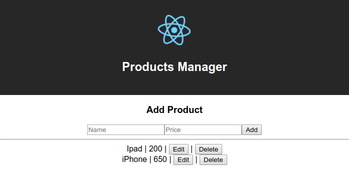
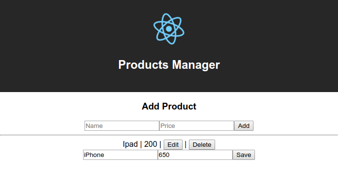

## Simple CRUD App REACT



## Folder Structure

You should match your file by adding some files in the src/folder as below :

```
my-react-crud/
  package.json
  README.md
  node_modules/
  public/
  src/
    AddProduct.js
    ProductItem.js
```

> another result (edited product)

