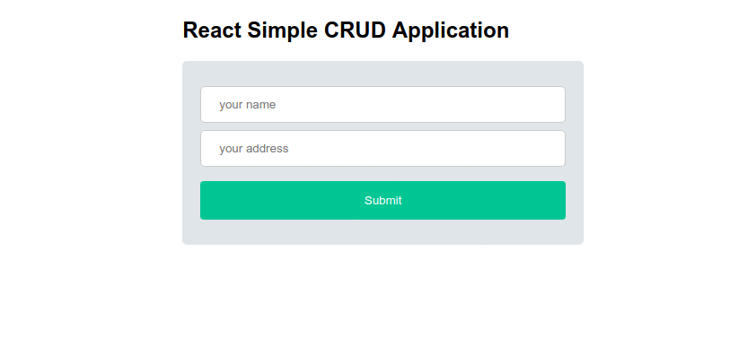

# Simple CRUD (create, read, update, delete)


### How to develop :
  - Clone this repo `git clone https://github.com/rahmandikahaekal/ReactJS-CRUD.git`
  - After cloned, you can run the folder react with 
    - cd (into cloned folder)
    - npm start / yarn start
  - If not working or you have a troble, you can create a new file and copy those files to your new folder react
    - create-react-app `your own react folder`
    - copy the cloned file, to your new folder created

```
simple-crud/
  package.json
  README.md
  node_modules/
  public/
  src/
    App.css
    App.js
    index.css
    index.js
```